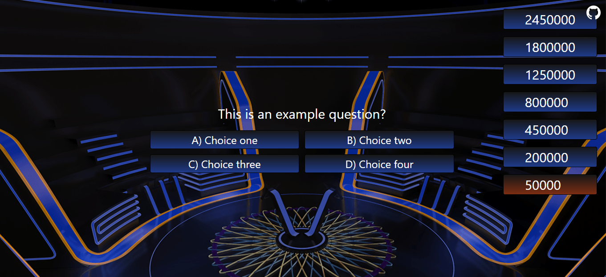

# 🤑 Millionaire
"Who Wants to be a Millionaire?" template.



## Technologies
* Frontend: Tailwind CSS + Vue.js

## Usage
* Clone this repo.
```bash
$ git clone https://github.com/orhanemree/millionaire.git
$ cd millionaire
$ npm i
$ npm run dev
```
* Edit `getQ()` function in `/src/App.vue` according to where you want to get the questions. It can be from API, database or a file.

## Reference
* Sounds from [Soundboard](https://www.soundboard.com/sb/onemilliondollars).

## License
* [MIT](LICENSE).